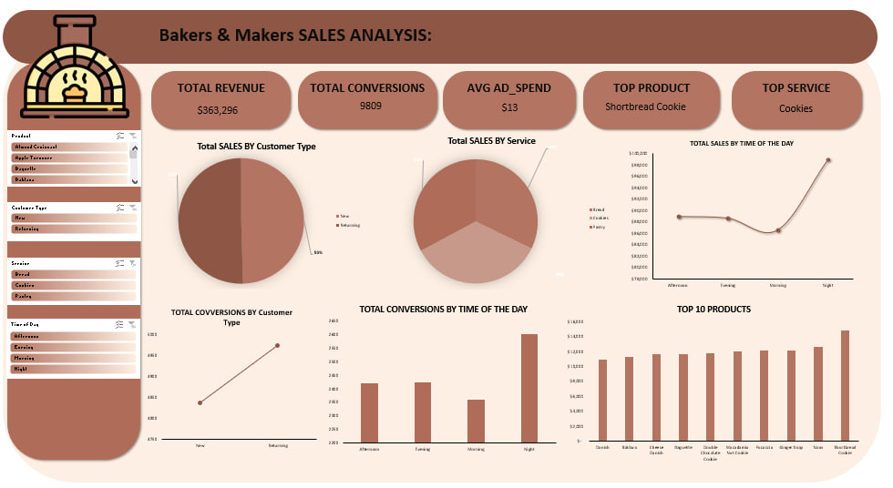

# 🍪 Bakers & Makers Sales Dashboard - Excel

## 📌 Project Overview
This dashboard provides a complete sales performance overview for **Bakers & Makers**, a bakery business specializing in bread, cookies, pastries, and other baked goods. Built entirely in **Microsoft Excel**, the dashboard tracks revenue, conversions, ad spend efficiency, and product performance to support data-driven decision-making for inventory, marketing, and operations.

## 🖥️ Dashboard Preview

## 🎯 Objectives
- Monitor total revenue, conversions, and average ad spend.
- Analyze sales and covering (coverage) distribution by customer type.
- Identify peak conversion times throughout the day.
- Highlight top-performing products and services.
- Provide actionable insights to optimize product offerings and marketing strategies.

## 🛠️ Tools Used
- **Microsoft Excel** – Dashboard design (Pivot Tables, Charts, Slicers, Formulas)

## 💡 Key Insights
- **Total Revenue** reached **$363,296**, with **9,809** total conversions.
- **Average ad spend** is **$13**, indicating cost-efficient customer acquisition.
- **Shortbread Cookie** is the **top product**, while **Cookies** lead as the top service category.
- **Cookies** generate the highest sales and coverage among customer types, followed by **Bread** and **Pastries**.
- **Morning** and **Afternoon** are the peak conversion times, suggesting high foot traffic or online orders during these periods.
- The **top 10 products** are dominated by cookie and bread varieties, reinforcing their importance to overall revenue.

## 📋 Dashboard Features

### Key Performance Indicators (KPIs)
- **Total Revenue** – Overall sales generated
- **Total Conversions** – Number of completed purchases
- **Average Ad Spend** – Cost per conversion
- **Top Product & Service** – Best-performing items

### Filters & Interactivity
- Slicers to filter data by:
  - Product Category (Bread, Cookies, Pastries, Other)
  - Customer Type
  - Time of Day

### Visualizations
- **Bar charts** – Sales and coverings by customer type
- **Bar chart** – Conversions by time of day
- **Horizontal bar chart** – Top 10 products
- **Cards** – KPI summaries at the top
